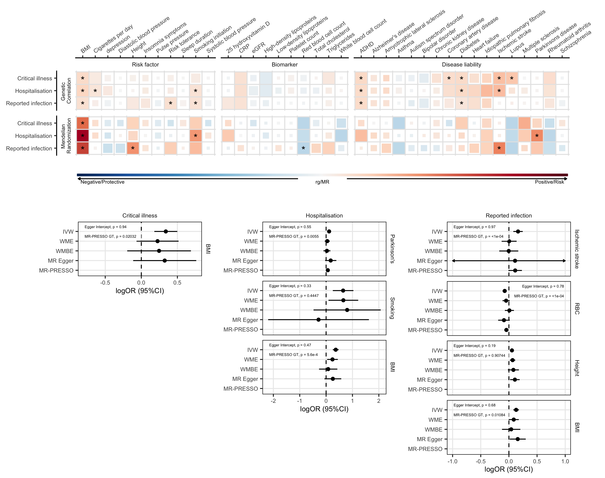

# Causal effect of modifiable risk factors on COVID
Esimating the shared genetic eitology and the causal association of potentially modifiable risk factors on SARS-CoV-2 infection and COVID-19 severity using genetic correlation (rg) and Mendelian randomization (MR).

Citation: The COVID-19 Host Genetics Initative. 2021. Mapping the human genetic architecture of COVID-19 by worldwide meta-analysis. [MedRxiv](https://www.medrxiv.org/content/10.1101/2021.03.10.21252820v1). doi:10.1101/2021.03.10.21252820.

## Data Avaliability
### Exposures

A set of 38 disease, health and neuropsychiatric phenotypes were selected as potential COVID-19 risk factors based on their putative relevance to the disease susceptibility, severity, or mortality. Initial risk factors were selected based on guidelines from the [CDC](https://www.cdc.gov/coronavirus/2019-ncov/need-extra-precautions/people-with-medical-conditions.html) and [OpenSafely](https://www.nature.com/articles/s41586-020-2521-4).

* `docs/mrcovid_exposures.xlsx`: excel file listing the traits and respective GWAS used as exposures.

### Outcomes
Genome-wide assocations studies for COIVD-19 susceptibility and severity were obtained from Release 5 of the [COVID-19 host genetics initiative](https://5f91b3fda119c20007acd6e6--condescending-perlman-ec107b.netlify.app/).

Outcomes included:
* SARS-CoV-2 reported infection
* COVID-19 Hospitalization
* COVID-19 Critical Illness

## Data Analysis
The Snakemake workflow management system was used to implement pipelines for the rg and MR anlaysis. Rules defineding the snakemake workflows for the rg and MR analyses are avliable in `workflow/rules/rg.smk` and `workflow/rules/mr.smk`. Scripts for implementing polygenic risk score analyses were not utlized in this analysis. This pipeline is a adapted from [Andrews et al (2020) Annals of Neurology](https://dx.doi.org/10.1002/ana.25918).

Final output files used in the current publication are avaliable in `docs/20210224`.

### Genetic Correlation
Genetic correlations between the exposures and outcomes was estimated using LD Score (LDSC) regression.

Snakefile:
 *  `workflow/rules/rg.smk`: workflow for implementing MR anlaysis

 Configuration files:
  * `config_rg_covid.yaml`: parameters for implementing rg analysis

 Script files:
  * `workflow/scripts/mr_*`: script files for implementing spefific rules in the rg workflow

### MR

Mendelian randomization analysis was conducted using the TwoSampleMR package. Primary analysis was conducted using IVW to estimated causal relationships, while senstivity analysis were conducted using WME, WMBE, MR-Egger and MR-PRESSO.

Snakefile
  *  `workflow/rules/mr.smk`: workflow for implementing MR anlaysis

Configuration files
  *  `config_covid_eur.yaml`: analysis parameters for MR analysis COIVD-19 ouctomes using EUR only popultions
  *  `config_covid_eur_wo_ukbb.yaml`: analysis parameters for MR analysis COIVD-19 ouctomes using EUR only popultions, without samples from UKBB

Script files
 * `workflow/scripts/mr_*`: script files for implementing spefific rules in MR workflow

 ## Results

 

Genetic correlations and Mendelian randomization causal estimates between 38 traits and COVID-19 Critical Illness, COVID-19 Hospitalization and SARS-CoV-2 reported infection. Blue, negative genetic correlation and protective Mendelian randomization (MR) causal estimates; red, positive genetic correlation and risk MR causal estimates. Larger squares correspond to more significant P values, with genetic correlations or MR causal estimates significantly different from zero at a P < 0.05 shown as a full-sized square. Genetic correlations or causal estimates that are significantly different from zero at a false discovery rate (FDR) of 5% are marked with an asterisk. Forest plots display the causal estimates for each of the sensitivity analyses used in the MR analysis for trait pairs that were significant at an FDR of 5%. Individual scatter and funnel plots for each pair of traits are available in `docs/20210224/MRcovideur_MRScatterFunnelPlots.pdf`.

IVW: Inverse variance weighted analysis; WME: Weighted median estimator; WMBE: weighted mode based estimator; MR-PRESSO: Mendelian Randomization Pleiotropy RESidual Sum and Outlier. RBC: Red blood cell count

Genetic correlation results:
 * `data/RGcovid` contains intermediatry files generated during rg workflow
 * `results/RGcovid` contains final results for rg analysis

MR results
 * `data/MRcovideur`, and `data/MRcovideurwoukbb` contain intermediatry files generated during MR workflow
 * `results/MRcovideur`, and `results/MRcovideurwoukbb` contain final results for MR analysis
